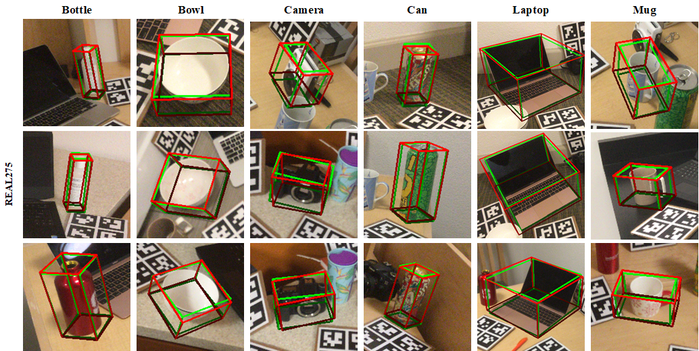
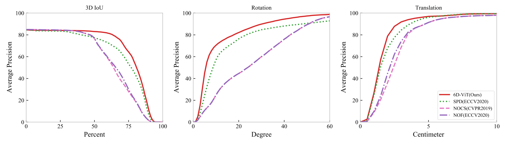

# 6D-ViT




## Overview

This is the offical repository of our recent work [**6D-ViT: Category-Level 6D Object Pose Estimation via Transformer-Based Instance Representation Learning**](https://ieeexplore.ieee.org/document/9933183), we provide the pose estimation results on the REAL275 testset to evaluate the performance of our method.

More information will be released soon.


## Dependencies

* Python 3.6
* PyTorch 1.7.1+cu110
* CUDA 11.2
* OpenCV-python 4.4.0


## Evaluation on the REAL275 testset


* Download the Mask R-CNN results, pose predictions by NOCS, NOF, SPD and our 6D-ViT from [here](https://drive.google.com/file/d/1BHHqP7tKkQos4_H0NtztWoy79-YdnVrP/view?usp=sharing)
* The pretrained model on the NOCS-REAL dataset is [here](https://drive.google.com/file/d/1IEPk8BOpBnvNPBdLf4wh_pp5irWT3FsJ/view?usp=drive_link)


```
unzip -q real_test.zip
ROOT=/path/to/6D-ViT
mkdir $ROOT/results
mv real_test/* $ROOT/results
rmdir real_test
cd $ROOT
python evaluate_mean_real.py
```


The evaluation results will be generated under the folder _$ROOT/results/6D-ViT_results/real_test/_





<table>
    <tr>
        <td>Dataset</td> 
        <td>Category</td> 
        <td>3D<sub>50</sub></td>
        <td>3D<sub>75</sub></td> 
        <td>5°2cm</td> 
        <td>5°5cm</td> 
        <td>10°2cm</td> 
        <td>10°5cm</td> 
        <td>10°10cm</td> 
   </tr>
    <tr>
        <td rowspan="7">REAL275</td>    
        <td >Bottle</td>  
        <td >0.5766</td>  
        <td >0.5005</td>  
        <td >0.5799</td> 
        <td >0.6318</td> 
        <td >0.7969</td> 
        <td >0.8703</td> 
        <td >0.9752</td> 
    </tr>
    <tr>
        <td >Bowl</td>  
        <td >0.9999</td>  
        <td >0.9992</td>  
        <td >0.7874</td>  
        <td >0.8186</td>  
        <td >0.9548</td>  
        <td >0.9914</td>  
        <td >0.9914</td>  
    </tr>
    <tr>
        <td >Camera</td> 
        <td >0.8709</td>  
        <td >0.1917</td>  
        <td >0.0000</td>  
        <td >0.0000</td>  
        <td >0.0014</td>  
        <td >0.0019</td>  
        <td >0.0019</td>  
    </tr>
    <tr>
        <td >Can</td>  
        <td >0.7146</td>  
        <td >0.6996</td>  
        <td >0.5350</td>  
        <td >0.5624</td>  
        <td >0.8573</td>  
        <td >0.9551</td>  
        <td >0.9555</td>  
    </tr>
    <tr>
        <td >Laptop</td>  
        <td >0.8334</td>  
        <td >0.6170</td>  
        <td >0.3383</td>  
        <td >0.4461</td>  
        <td >0.6163</td>  
        <td >0.9217</td>  
        <td >0.9361</td>  
    </tr>
    <tr>
        <td >Mug</td>  
        <td >0.9878</td>  
        <td >0.8577</td>  
        <td >0.0490</td>  
        <td >0.0524</td>  
        <td >0.3166</td>  
        <td >0.3333</td>  
        <td >0.3333</td>  
    </tr>
    <tr>
        <td >Average</td>  
        <td >0.8306</td>  
        <td >0.6443</td>  
        <td >0.3816</td>  
        <td >0.4186</td>  
        <td >0.5906</td>  
        <td >0.6789</td>  
        <td >0.6989</td>  
    </tr>
</table>


# Citation

If you find this work helpful, please consider citing


```
@article{zou20226d,
  title={6d-vit: Category-level 6d object pose estimation via transformer-based instance representation learning},
  author={Zou, Lu and Huang, Zhangjin and Gu, Naijie and Wang, Guoping},
  journal={IEEE Transactions on Image Processing},
  volume={31},
  pages={6907--6921},
  year={2022},
  publisher={IEEE}
}

```


# Acknowledgement

Our work is built upon [object-deformnet](https://github.com/mentian/object-deformnet), we thank the authors for releasing their code.
